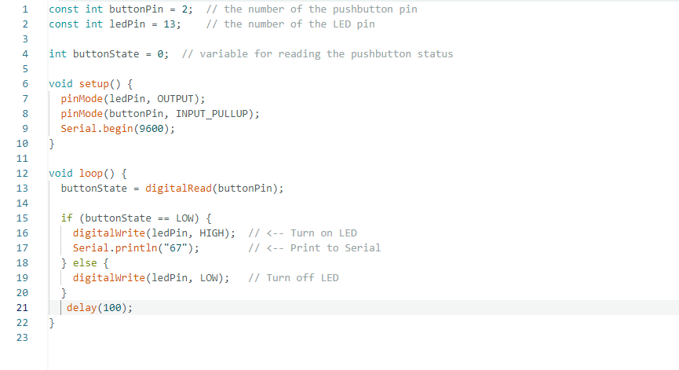
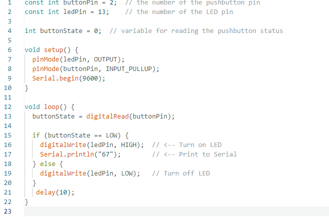

Project Journals 

I started to create a code that would turn on a light and print "67" whenever the button was pressed.
 Afterwards, I created a small circuit with a bread board, a microswitch, a blue gumdrop LED, and a Raspberry Pi pico to test
 how to have the serial monitor add values and have the LED to show reactivity so the player can see both the score go up and the light flash. However the flash from the LED was too fast and would repeatidly light on and off as the button was beign pressed. To fix the issue I added a delay of 10.

This is a test to see how the text is formated.